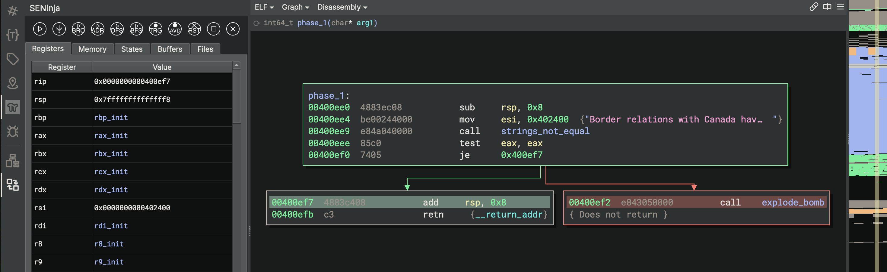
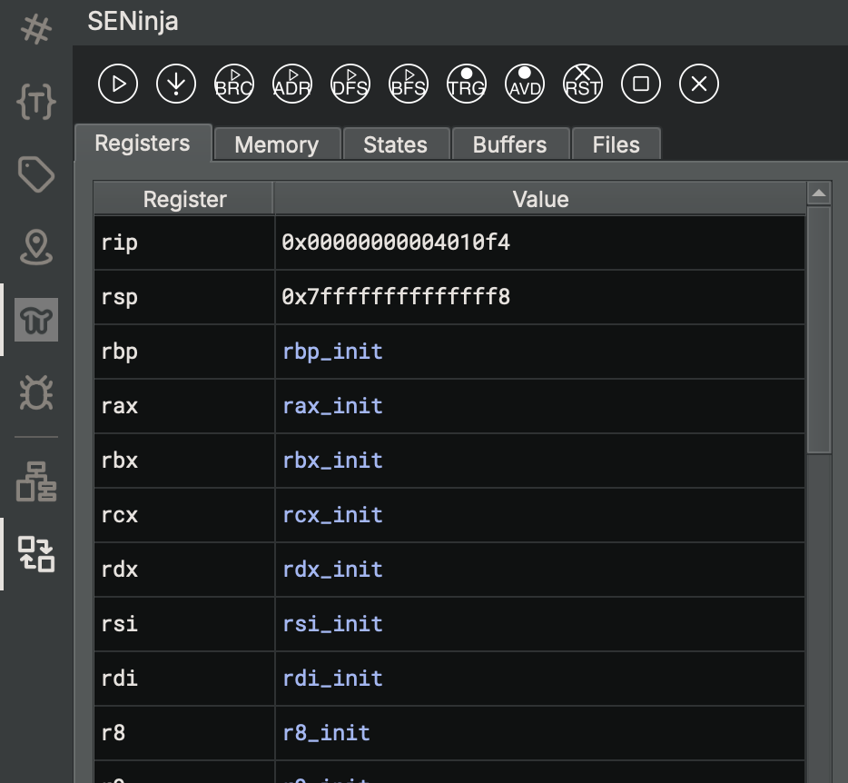
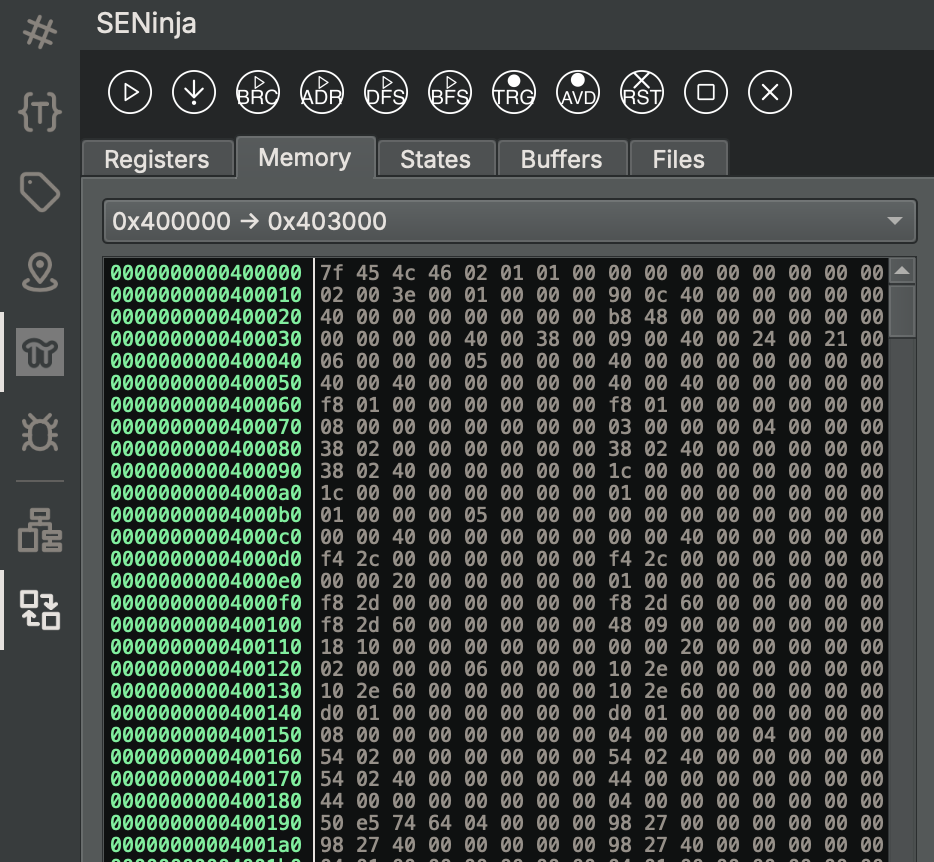
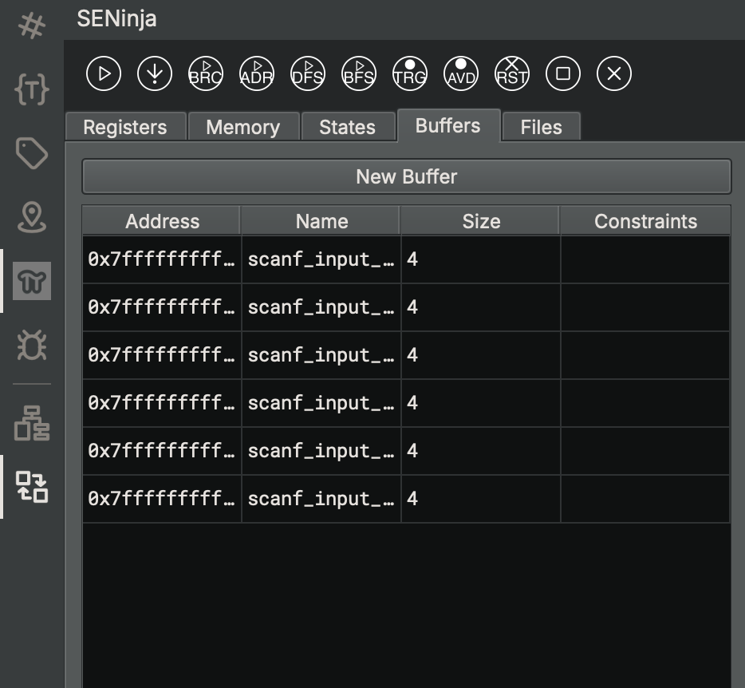

# SENinja - Symbolic Execution Plugin for Binary Ninja

This is a binary ninja plugin that implements a symbolic execution engine based only on z3, highly inspired by the _angr framework_ (https://angr.io/). 
The plugin is implemented as an emulator of LLIL instructions that builds and manipulates z3 formulas. 

SENinja simulates a debugger: the execution is _path driven_, only one state is _active_ and executes instructions. The other states, generated at branches, are saved in a _deferred queue_. At any time, the active state can be changed with a deferred one.

### UI Widgets

SENinja comes with a side-panel widget that can be used to start and control the execution using the following buttons:

- : start the execution
- : step the current state
- : run until branch
- : execute the current state until the currently selected address
- : start a DFS search
- : start a BFS search
- : set the currently selected address as the target of the search
- : avoid the currently selected address during a search
- : reset targets and avoid addresses
- : stop a search
- : reset SENinja

#### Register View


The Register View can be used to visualize the value of the registers of the active state. The value of a register can be modifyied by double-clicking on it. The right-click menu allows to:
- Copy the content of the register
- Concretize the value of the register
- Evaluate the value of the register using the solver
- Inject symbols
- Show the register expression
- Set the register to the address of a buffer created with the buffer view

#### Memory View


The Memory View can be used to visualize the value of a portion of memory of the active state. By clicking on "monitor memory", the user can specify a memory address to monitor. The widget will show 512 bytes starting from that address. 
The memory view is splitted in two sections: an hexview and an ascii view. The hexview shows the hex value of each byte only if the byte is mapped and concrete. If the byte is unmapped, the characted `_` is shown; if the byte is symbolic, the widget shows the character `.`. 

The right-click menu allows to:
- Copy the selection (in various format, e.g. little-endian, binary, etc.)
- Concretize the value of the selection
- Evaluate the value of the selection using the solver
- Inject symbols

#### Buffers View

This widget allows the creation of buffers containing symbolic data.

### Command Line APIs

More APIs can be executed through the python shell. For example, we can use the solver to _prove_ a condition for the current state:
``` python
>>> import borzacchiello_seninja as seninja
>>> s = seninja.get_current_state()
>>> s.solver.satisfiable(extra_constraints=[s.regs.eax == 3])
```
the code will check the satisfiablity of `eax == 3` given the path constraint of the active state.

Consult the [wiki](https://github.com/borzacchiello/seninja/wiki) to have more info about the commands.

### Settings

SENinja gives to the user the possibility to configure many parts of the symbolic engine (e.g. dimension of pages, symbolic memory access strategy, etc.). 
All the available settings can be accessed and modified by clicking on `Edit/Preferences/Settings` and selecting `SENinja` in the left widget.


#### Version and Dependencies
Tested with 
- binary ninja `4.0` with personal license
- python `3.11`
- z3 `4.8.14`

To make it work, you need to install z3 with pip:
`$ pip3 install z3-solver`
