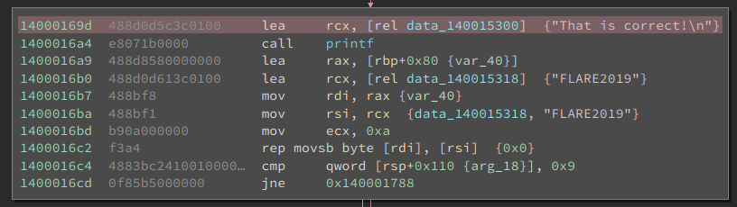

# SENinja - Symbolic Execution Plugin for Binary Ninja

This is a binary ninja plugin that implements a symbolic execution engine based only on z3, highly inspired by the _angr framework_ (https://angr.io/). 
The plugin is implemented as an emulator of LLIL instructions that builds and manipulates z3 formulas. 

SENinja simulates a debugger: the execution is _path driven_, only one state is _active_ and executes instructions. The other states, generated at branches, are saved in a _deferred queue_. At any time, the active state can be changed with a deferred one.

Refer to [this survey](https://arxiv.org/pdf/1610.00502.pdf) if you want to know more about symbolic execution.

### Commands


The plugin adds the following commands, accessible through the GUI:
- `Start symbolic execution`: can be executed by right-clicking on an instruction. The command creates a symbolic state at the current address. By default, the uninitialized registers and memory locations are considered symbolic (this can be changed in the settings). This new state becomes the active state, highlighted in green on the disassembly graph.
- `Change current state`: can be executed by right-clicking on a deferred state (highlighted in red on the disassembly graph). The deferred state becomes the new active state. If more than one state is at that address, the last one that reached the address becomes the active state.
- `Step`: when executed, the active state executes one instruction.
- `Continue until branch`: when executed, the active state executes instructions until a _symbolic_ branch is reached, i.e., until the state _forks_ in two states.
- `Continue until address`: can be executed by right-clicking on an address. The active state will execute instructions until it reaches the target address. Notice that there is no search algorithm implemented: the active state will simply follow _true_ branches (if it can choose). If you use this command, be sure that the state will actually reach the instruction, otherwise it will loop.
- `Merge states`: can be executed by right-clicking on the active state. The command will _merge_ all the deferred states that share the same instruction pointer with the active state. Note that the solver can become significantly slower while reasoning on a merged state. 
- `Reset symbolic execution`: this command resets symbolic execution. It clears the GUI and releases active and deferred states.

---

More APIs can be executed through the python shell. For example, we can use the solver to _prove_ a condition for the current state:
```
>>> import seninja
>>> s = seninja.get_current_state()
>>> s.solver.satisfiable(extra_constraints=[s.regs.eax == 3])
```
the code will check the satisfiablity of `eax == 3` given the path constraint of the active state.

### Settings

SENinja gives to the user the possibility to configure many parts of the symbolic engine (e.g. dimension of pages, symbolic memory access strategy, etc.). 
All the available settings can be accessed and modified by clicking on `Edit/Preferences/Settings` and selecting `SENinja` in the left widget.

### UI Widgets

SENinja comes with two widgets that can be used to visualize the registers and a portion of memory of the active state. The widgets are disabled by default, but can be activated by clicking on `View/Show SENinja Registes` and `View/Show SENinja Memory`. 

#### Register View


The Register View can be used to visualize the value of the registers of the active state. The value of a register can be modifyied by double-clicking on it. The right-click menu allows to:
- Copy the content of the register
- Concretize the value of the register
- Evaluate the value of the register using the solver
- Inject symbols
- Show the register expression

#### Memory View


The Memory View can be used to visualize the value of a portion of memory of the active state. By clicking on "monitor memory", the user can specify a memory address to monitor. The widget will show 512 bytes starting from that address. 
The memory view is splitted in two sections: an hexview and an ascii view. The hexview shows the hex value of each byte only if the byte is mapped and concrete. If the byte is unmapped, the characted `_` is shown; if the byte is symbolic, the widget shows the character `.`. 

Double-clicking on a byte allows the user to modify its value in the active state.
The right-click menu allows to:
- Copy the selection (in various format, e.g. little-endian, binary, etc.)
- Concretize the value of the selection
- Evaluate the value of the selection using the solver
- Inject symbols

#### Use Case - FLARE-ON 6, Challenge 11 (AVX2 Virtual Machine)

This section shows how _SENinja_ can be used to solve challenge 11 of  _flare-on 6_ challenge in an automatic way. 
The challenge can be downloaded at [flare-on 2019](https://www.fireeye.com/blog/threat-research/2019/09/2019-flare-on-challenge-solutions.html).

The challenge implements a `base64` decoder, obfuscated with a virtual machine based on `AVX2`. 

The `main` function of the binary can be found at the address `0x140001220`. 
After checking whether the cpu supports `AVX2`, the binary reads two command line arguments:
- the first one with a length between 5 and 32 bytes
- the second one with a length of exactly 32 bytes.

Looking at `0x1400016cd`, we can see that the first argument must be equal to `FLARE2019`. 
We can use SENinja to compute the 32 bytes of the second argument.

We can start by creating a new state in `main` function, just after the `cpuid` checks at address `0x140001293` (right click on the address, `SENinja/Start symbolic execution`).

Then, we can setup argv from the python shell:
``` python
import seninja
s = seninja.get_current_state()

inp0 = seninja.BVV(0x464c4152453230313900, 10*8)  # create concrete string FLARE2019
inp1 = seninja.BVS('inp', 32*8).Concat(seninja.BVV(0, 8))  # create symbolic string of 32 bytes

argv = s.mem.allocate(24)  # allocate argv
inp0_p = s.mem.allocate(10)  # allocate argv[1]
inp1_p = s.mem.allocate(32)  # allocate argv[2]
s.mem.store(argv+8, seninja.BVV(inp0_p, 64), 'little')
s.mem.store(argv+16, seninja.BVV(inp1_p, 64), 'little')
s.mem.store(s.regs.rsp+0x1488, seninja.BVV(argv, 64), 'little')
s.mem.store(inp0_p, inp0)
s.mem.store(inp1_p, inp1)
```

Now, we can limit `inp1` to have only alphanumeric characters:
``` python
for i in range(1, 33):
    b = inp1.Extract((i+1)*8-1, i*8)
    s.solver.add_constraints(seninja.Or(
        seninja.And(
            ord("a") <= b, b <= ord("z")
        ),
        seninja.And(
            ord("A") <= b, b <= ord("Z") 
        ),
        seninja.And(
            ord("0") <= b, b <= ord("9")
        )
    ))
```

We have set up the state. We can continue symbolic execution until a symbolic branch is reached (right click, `SENinja/Continue until branch`).
After a few seconds (~20), SENinja will stop at `0x14000178a`. As we can see, the engine generated a deferred state at `0x14000169d` with a reference to the string `This is correct`.


We can select this state (right click, `SENinja/Select current state`) and, from the shell, we can compute the correct command line argument:
``` python
s = seninja.get_current_state()
seninja.int_to_str(s.solver.evaluate(inp1).value)
```

which is
```
cHCyrAHSXmEKpyqoCByGGuhFyCmy86Ee
```

Indeed, running the program with

`$ wine vv_max.exe FLARE2019 cHCyrAHSXmEKpyqoCByGGuhFyCmy86Ee`

we obtain the flag:
```
That is correct!
Flag: AVX2_VM_M4K3S_BASE64_C0MPL1C4T3D@flare-on.com
``` 

[here](https://drive.google.com/open?id=13qFmoFow9OA-l3v4TpS7_4YM88drxM5P), you can download a video that shows the process.

#### Limitations
One main limitation of the plugin is the fact that the _status register_ is not explicitly modeled for every instructions, but is computed only when the analyses of binary ninja discovers that its value is needed for the computation of a certain condition. 
While this approach works for the vast majority of situations, the emulation becomes inaccurate if the stautus register is used in a way that binary ninja does not predict (e.g., if the value of the status register is used accross function boundaries).
This is a limitation of LLIL. To fix this, SENinja should use the LiftedIL instead of LLIL, implementing architecture-dependent status-flag handlers for every instructions.


Another main limitation of the plugin is given by the fact that system calls and external functions must be handled with handly written models (similarly to angr). While I have implemented some models (you can find them in the `models` subfolder), they are far from being complete. When SENinja reaches an unmodeled syscall or external function, it raises an exception.


Finally, even if most of the code is architecture-independent, to support a new architecture SENinja needs some information that must be manually specified (e.g., list of registers, calling conventions, etc.). You can find examples in the `arch` subfolder. Furthermore, some instructions are not modeled by LLIL (e.g. most AVX2 instructions), so that instructions must be handled in an architecture-dependent way. You can find the models for AVX2 instructions as a reference in `arch/arch_x86_64_sph.py`.
Currently, SENinja (partially) supports `x86`, `x86_64` and `ARMv7`.

#### Version and Dependencies
Tested with 
- binary ninja `1.2.2001-dev` personal license
- python `3.6.9` 
- z3 `4.8.7`

To make it work, you need to install z3 with pip:
`$ pip3 install z3-solver`
